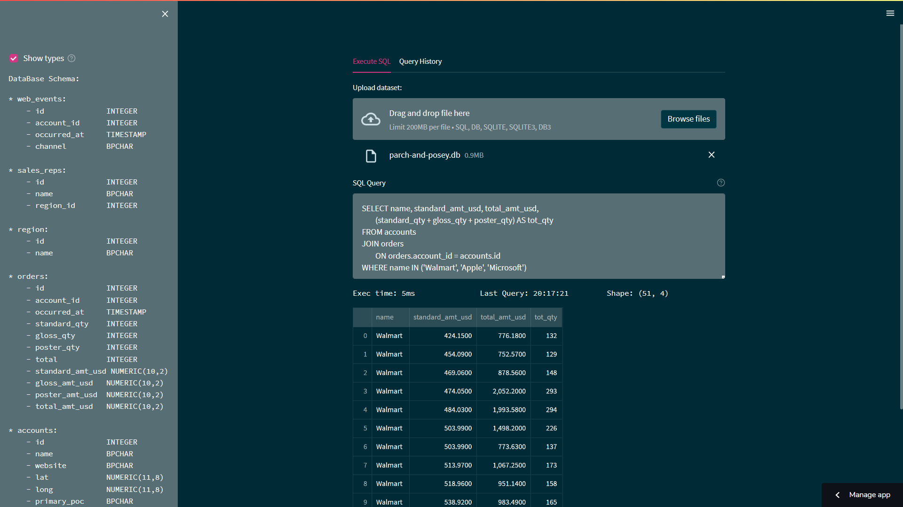
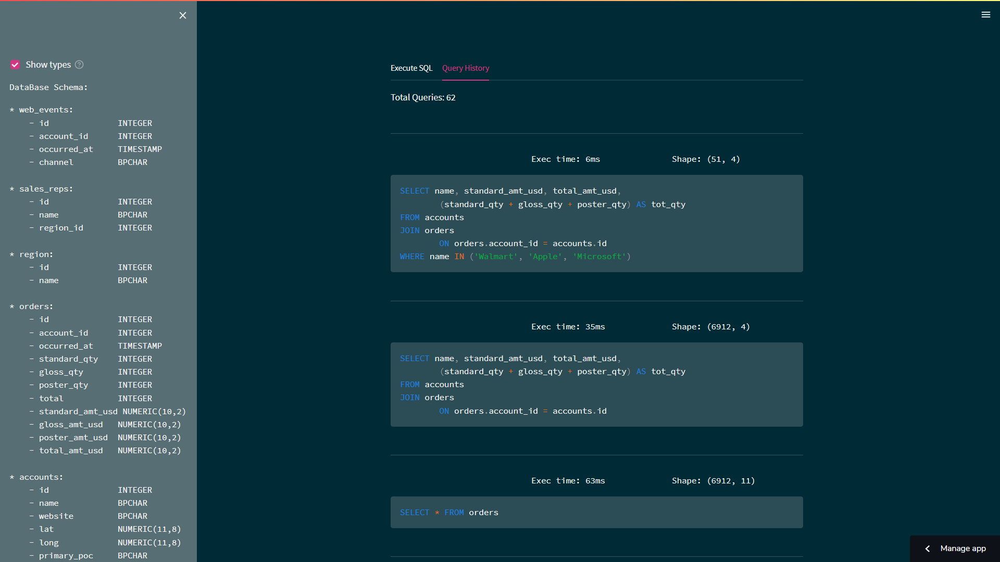

# Streamlit SQLite-Viewer

A Web-app that lets you execute SQL queries quickly, and view the results
as a DataFrame.  
The engine used for executing the queries is SQLite3 which is super fast !

You can now use the web app directly [online](https://shner-elmo-streamlit-sqlite-viewer-main-8a6xhp.streamlitapp.com/)

# TODO list:
- [x] Add sample dataset
- [x] Add screenshots
- [x] Add styling to the background and table
- [x] Optimize file upload block
- [x] Add query history
- [ ] Add more "Save as ..." options
